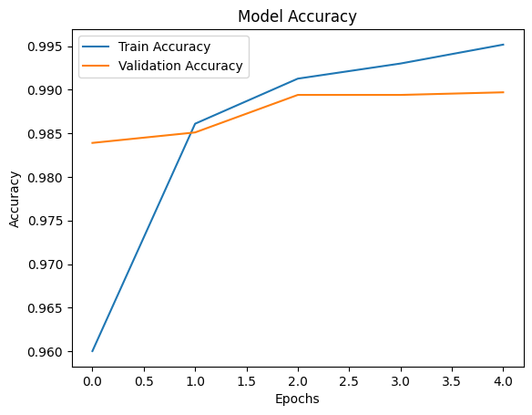
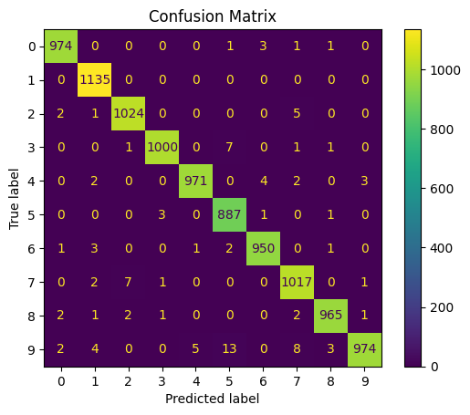

# ✍️ Handwritten Digit Recognition using CNN

## 📌 Objective
To recognize handwritten digits (0–9) using deep learning.

## 🧠 Model Used
- Convolutional Neural Network (CNN)

## 📊 Dataset
- MNIST dataset (60,000 training images, 10,000 testing images)

## ⚙️ Workflow
1. Data loading
2. Preprocessing (normalization & reshaping)
3. CNN model building
4. Training & validation
5. Evaluation

## 📈 Results
- Test Accuracy: 98.97%

## 📷 Visualizations

### Accuracy Graph

### Confusion Matrix

## 🛠 Technologies Used
- Python
- TensorFlow / Keras
- NumPy
- Matplotlib

## 💡 Future Improvements
- Extend to alphabet recognition (EMNIST)
- Build real-time digit recognizer
- Deploy using Streamlit
